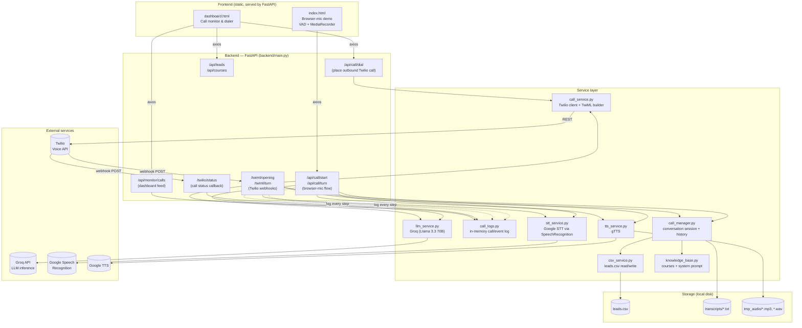

# 📞 Bengali Cold-Call Agent

An AI voice agent that cold-calls leads in **Bengali**, pitches a course, holds a live back-and-forth conversation, and auto-classifies the outcome — runnable either as a **real Twilio phone call** or as a **browser mic demo** with zero telephony setup.

Repo: https://github.com/al-kafi-sohag/beta-cold-calling.git

---

## ✨ What it does

- Dials (or simulates dialing) a lead and opens the conversation in Bengali using an LLM-driven sales script.
- Listens to the lead's reply, transcribes it, generates the next reply, and speaks it back — turn after turn, with no fixed script depth.
- Automatically classifies each call as `interested`, `not_interested`, `callback_requested`, or leaves it `undecided` and keeps going.
- Persists leads and outcomes to a CSV "mini-CRM" and saves a full text transcript per call.
- Ships a live **monitor dashboard** to dial leads, pick an STT strategy per call, and watch call events/timeline in real time.

---

## 🏗️ Architecture



### Two ways a call happens

**1. Browser-mic demo** (`index.html`) — no Twilio account needed
`Mic (VAD) → POST /api/call/start → POST /api/call/turn (loop)` — the browser records speech locally, uploads it, plays back the agent's audio reply, and repeats until the LLM marks the call as decided.

**2. Real Twilio phone call** (`dashboard.html`)
`Dashboard → POST /api/call/dial → Twilio dials the lead → Twilio hits /twiml/opening → then /twiml/turn on every reply, in a loop, until the call ends.` Twilio also pings `/twilio/status` independently so the real call state (ringing/answered/completed) is always known, even if the app-level conversation never reaches a clean ending.

Per call, the STT strategy is chosen from the dashboard:
- **`record`** — Twilio `<Record>`s the lead, the app downloads the recording and runs it through the same Google STT pipeline as the browser demo (more accurate for Bengali).
- **`gather`** — Twilio's own built-in `<Gather>` speech recognition (faster, no download round-trip, less accurate for Bengali).

---

## 🧱 Tech stack

| Layer | Technology |
|---|---|
| Backend framework | FastAPI + Uvicorn (ASGI) |
| Telephony | Twilio Voice API (outbound calls, TwiML, recordings, status callbacks) |
| LLM | Groq API — `llama-3.3-70b-versatile` |
| Speech-to-text | Google Speech Recognition (via `SpeechRecognition`), audio normalized with `pydub` + `ffmpeg` |
| Text-to-speech | `gTTS` (Google Text-to-Speech), Bengali (`bn`) |
| Data store | CSV (`leads.csv`) via `pandas`, flat-file transcripts, in-memory call/session state |
| Frontend | Static HTML + vanilla JS, Tailwind CSS (CDN), Axios — served directly by FastAPI's `StaticFiles` |
| Containerization | Docker (`python:3.12-slim` + `ffmpeg`) |

---

## 📂 Project structure
.
├── main.py
├── config.py
├── knowledge_base.py
├── llm_service.py
├── stt_service.py
├── tts_service.py
├── call_manager.py
├── call_logs.py
├── call_service.py
├── csv_service.py
├── schemas.py
├── frontend/
│   ├── index.html
│   └── dashboard.html
├── requirements.txt
├── Dockerfile
└── LICENSE

> Note: `main.py` imports everything as `backend.*` (e.g. `from backend.config import ...`) and Docker runs `uvicorn backend.main:app`, so this project is expected to live inside a `backend/` package folder at runtime.

---

## ⚙️ Configuration

All configuration is via environment variables (see `config.py`):

| Variable | Purpose | Default |
|---|---|---|
| `GROQ_API_KEY` | Groq API key for the LLM | — |
| `TWILIO_ACCOUNT_SID` / `TWILIO_AUTH_TOKEN` | Twilio credentials | — |
| `TWILIO_FROM_NUMBER` | Twilio caller ID | — |
| `PUBLIC_BASE_URL` | Publicly reachable base URL (e.g. ngrok) for Twilio webhooks & audio playback | — |
| `TWILIO_GATHER_LANGUAGE` | Language hint for Twilio's built-in speech recognition | `bn-IN` |
| `LEADS_CSV_PATH` | Path to the leads CSV | `leads.csv` |
| `TRANSCRIPTS_DIR` | Where call transcripts are saved | `transcripts` |
| `AUDIO_TMP_DIR` | Scratch dir for generated/downloaded audio | `tmp_audio` |
| `MAX_TURNS` | Hard cap on conversation turns (`0` = unlimited, ends only on explicit interested/not_interested) | `0` |

---

## 🚀 Running locally

```bash
git clone https://github.com/al-kafi-sohag/beta-cold-calling.git
cd beta-cold-calling
pip install -r requirements.txt

export GROQ_API_KEY=your_key
uvicorn backend.main:app --reload --port 8000
```

- Browser demo: `http://localhost:8000/`
- Dashboard: `http://localhost:8000/dashboard`

For real Twilio calls, also set `TWILIO_ACCOUNT_SID`, `TWILIO_AUTH_TOKEN`, `TWILIO_FROM_NUMBER`, and `PUBLIC_BASE_URL` (an `ngrok` tunnel works well for local testing, since Twilio needs a public webhook URL).

### Docker

```bash
docker build -t bengali-cold-caller .
docker run -p 8000:8000 --env-file .env bengali-cold-caller
```

---

## 🔌 API surface

| Endpoint | Purpose |
|---|---|
| `GET /api/leads` / `POST /api/leads` | List / add leads |
| `GET /api/courses` | Course catalog |
| `POST /api/call/start` → `POST /api/call/turn` | Browser-mic demo flow |
| `POST /api/call/dial` | Place a real outbound Twilio call |
| `POST /twiml/opening` / `POST /twiml/turn` | Twilio webhooks (TwiML generation) |
| `POST /twilio/status` | Twilio call status callback |
| `GET /api/transcript/{phone}` | Fetch a saved transcript |
| `GET /api/monitor/calls` / `GET /api/monitor/calls/{call_id}` | Live call log for the dashboard |

---

## 📄 License

MIT — see [`LICENSE`](./LICENSE).